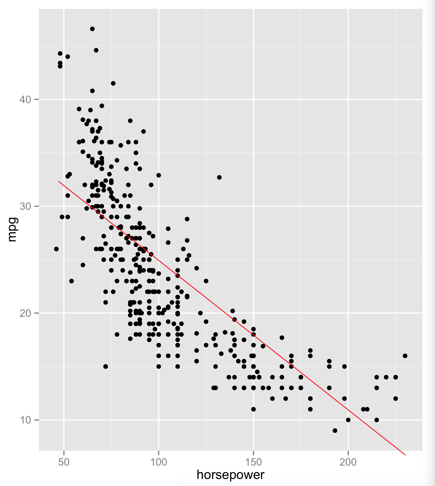
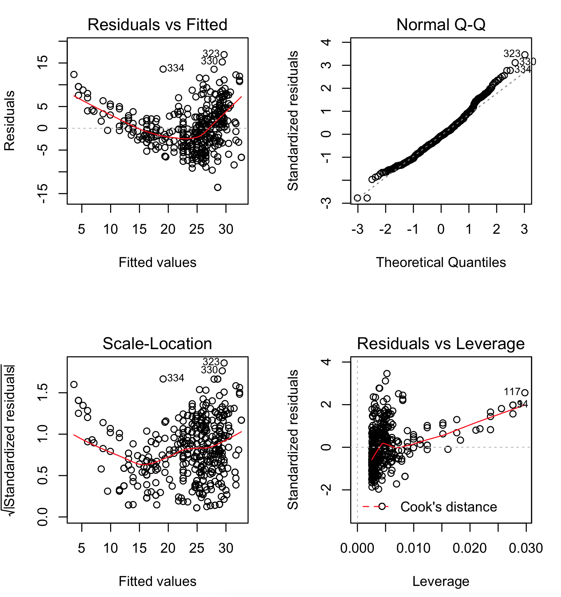

Question #8:  This question involves the use of simple linear regression on the Auto dataset.

1. Use the lm() function to perform a simple linear regression with the mpg as the response and the horsepower as the predictor. Use the summary() function to print the results. Comment on the output. For example:


(a) Is there a relationship between the predictor and the response?

**Answer**: First I had to clean the data. There were '?' in the horsepower data so I cleaned it by replacing them with NaN. Next, I did the following:
```r
auto_clean = auto[complete.cases(auto), ]
lm.fit = lm(mpg~horsepower, data=auto_clean)
summary(lm.fit)
```
With this I get the following answer:
```r
> summary(lm.fit)

Call:
lm(formula = mpg ~ horsepower, data = auto_clean)

Residuals:
     Min       1Q   Median       3Q      Max 
-13.5710  -3.2592  -0.3435   2.7630  16.9240 

Coefficients:
             Estimate Std. Error t value Pr(>|t|)    
(Intercept) 39.935861   0.717499   55.66   <2e-16 ***
horsepower  -0.157845   0.006446  -24.49   <2e-16 ***
---
Signif. codes:  0 ‘***’ 0.001 ‘**’ 0.01 ‘*’ 0.05 ‘.’ 0.1 ‘ ’ 1

Residual standard error: 4.906 on 390 degrees of freedom
Multiple R-squared:  0.6059,    Adjusted R-squared:  0.6049 
F-statistic: 599.7 on 1 and 390 DF,  p-value: < 2.2e-16
```
Given that the beta_1 value is not zero and is significant as confirmed by p-value, we can say that there is a relationship between mpg and horsepower.

2. How strong is the relationship between the predictor and the response?

**Answer:**The relationship between horsepower and mpg is fairly strong because we have a high F-statistic value of nearly 600. This is significant because the p-value is very small.

3. Is the relationship between the predictor and the response positive or negative?

**Answer:** The value of beta_1 is -0.1578 suggesting that it is negative. So the slope is negative.

4. What is the predicted mpg associated with a horsepower of 98? What is the associated 95% confidence interval and prediction intervals?

**Answer:**We have the following:
```r
> predict(lm.fit, data.frame(horsepower=(c(98))), interval='confidence')
       fit      lwr      upr
> 1 24.46708 23.97308 24.96108

> predict(lm.fit, data.frame(horsepower=(c(98))), interval='prediction')
       fit     lwr      upr
1 24.46708 14.8094 34.12476
```

(b) Plot the response and the predictor. Use the abline() function to display the least squares regression line.



(c) Use the plot() function to produce diagnostic plots of the least squares regression fit. Comment on any problems you see with the fit.



The plot of the residuals shows us that the linear regression fit is not optimum. This is clear from the shape of the mpg vs horsepower which is non-linear or has a U-shaped curve.