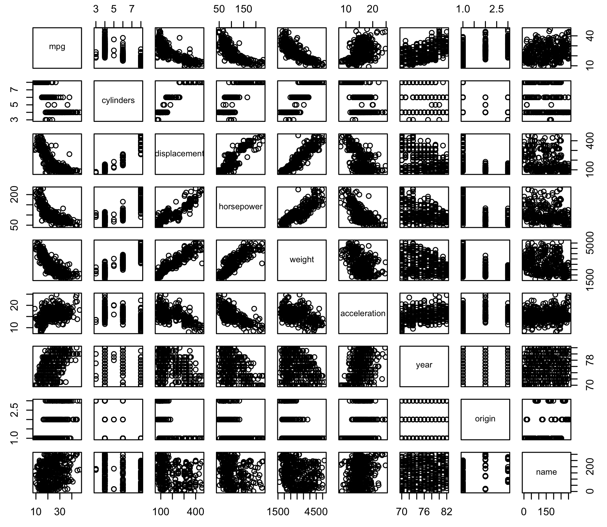
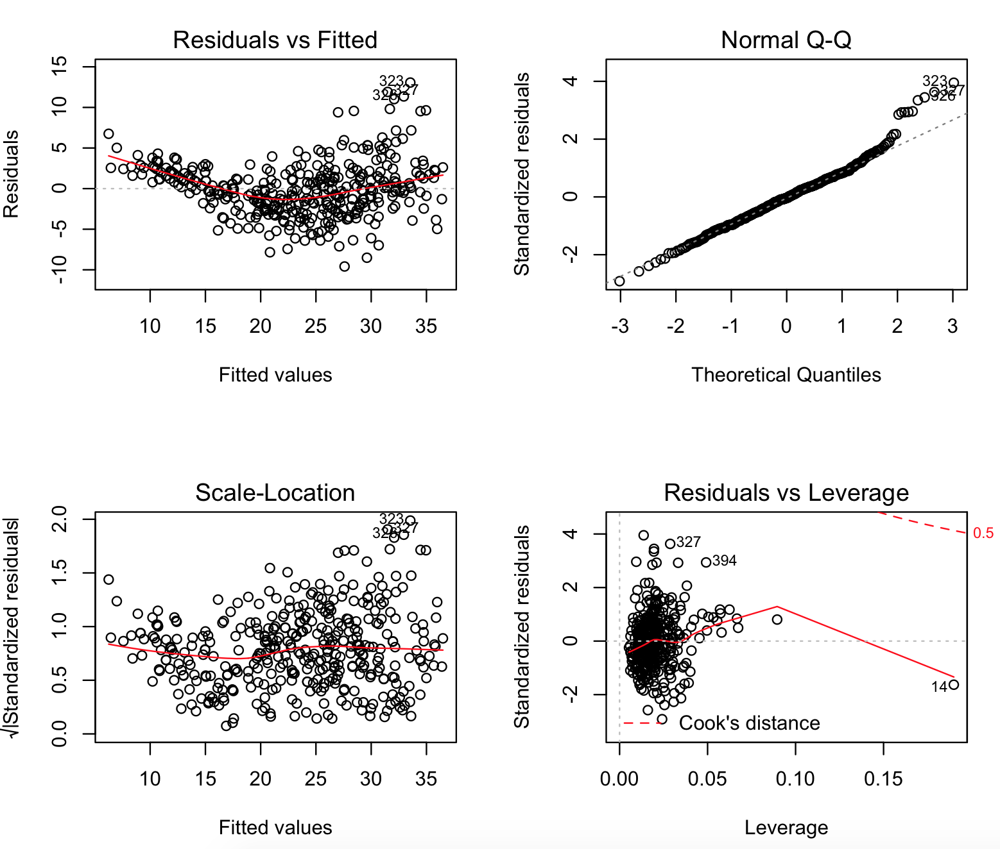
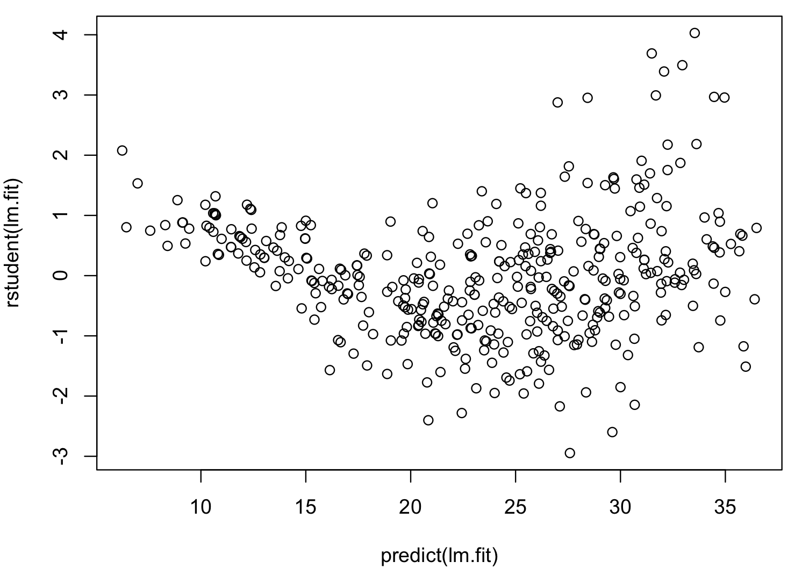

Problem #9: This question involves the use of multiple linear regression on the Auto data set.

(a) Produce a scatterplot matrix which includes all of the variables in the data set.
**Answer:** This is accomplished by the pairs() function in R
```r
Auto = read.csv('Auto.csv', header=TRUE)
pairs(Auto)
```
The result is the following:


(b) Compute the matrix of correlations between the variables using the function cor(). You will need to exclude the name variable, which is qualitative.
**Answer:** First we need to clean 'horsepower' as it has few NaNs then we remove the name variable and finally we compute the correlation matrix.
```r
Auto = Auto[complete.cases(Auto),]
auto_clean = Auto[1:8]

cor(auto_clean)
                    mpg  cylinders displacement horsepower     weight
mpg           1.0000000 -0.7776175   -0.8051269 -0.7784268 -0.8322442
cylinders    -0.7776175  1.0000000    0.9508233  0.8429834  0.8975273
displacement -0.8051269  0.9508233    1.0000000  0.8972570  0.9329944
horsepower   -0.7784268  0.8429834    0.8972570  1.0000000  0.8645377
weight       -0.8322442  0.8975273    0.9329944  0.8645377  1.0000000
acceleration  0.4233285 -0.5046834   -0.5438005 -0.6891955 -0.4168392
year          0.5805410 -0.3456474   -0.3698552 -0.4163615 -0.3091199
origin        0.5652088 -0.5689316   -0.6145351 -0.4551715 -0.5850054
             acceleration       year     origin
mpg             0.4233285  0.5805410  0.5652088
cylinders      -0.5046834 -0.3456474 -0.5689316
displacement   -0.5438005 -0.3698552 -0.6145351
horsepower     -0.6891955 -0.4163615 -0.4551715
weight         -0.4168392 -0.3091199 -0.5850054
acceleration    1.0000000  0.2903161  0.2127458
year            0.2903161  1.0000000  0.1815277
origin          0.2127458  0.1815277  1.0000000
```

(c) Use the lm() function to perform a multiple linear regression with mpg as the response and all other variables except name as the predictors. Use the summary() function to print the results. Comment on the output. For instance:

(i) Is there a relationship between predictors and the response?
**Answer:** I have the following:
```r
> lm.fit = lm(mpg~., data=auto_clean)
> summary(lm.fit)

Call:
lm(formula = mpg ~ ., data = auto_clean)

Residuals:
    Min      1Q  Median      3Q     Max
-9.5903 -2.1565 -0.1169  1.8690 13.0604

Coefficients:
               Estimate Std. Error t value Pr(>|t|)
(Intercept)  -17.218435   4.644294  -3.707  0.00024 ***
cylinders     -0.493376   0.323282  -1.526  0.12780
displacement   0.019896   0.007515   2.647  0.00844 **
horsepower    -0.016951   0.013787  -1.230  0.21963
weight        -0.006474   0.000652  -9.929  < 2e-16 ***
acceleration   0.080576   0.098845   0.815  0.41548
year           0.750773   0.050973  14.729  < 2e-16 ***
origin         1.426141   0.278136   5.127 4.67e-07 ***
---
Signif. codes:  0 ‘***’ 0.001 ‘**’ 0.01 ‘*’ 0.05 ‘.’ 0.1 ‘ ’ 1

Residual standard error: 3.328 on 384 degrees of freedom
Multiple R-squared:  0.8215,    Adjusted R-squared:  0.8182
F-statistic: 252.4 on 7 and 384 DF,  p-value: < 2.2e-16
```

Looking at the data we find that *cylinders*, *horsepower*, and *acceleration* have no correlation with *mpg*. Other than that all other predictors have a relationship with the response.

(ii) Which predictors appear to have a statistically significant relationship to the response?
**Answer:** Displacement, Weight, year, and origin have statistically significant relationship with the response.

(iii) What does the coefficient for the year variable suggest?
Given that the coefficient of the year is close to zero but not zero suggests that the value is very significant. Furthermore, the positive coefficient suggests that the cars become more fuel efficient with increasing year.

(d) Use the plot() function to produce diagnostic plots of the linear regression fit. Comment on any problems you see with the fit. Do the residual plots suggest any unusually large outliers? Does the leverage plot identify any observations with unusually high leverage?

**Answer:** We find that the residuals vs fitted value shows a U-shaped curve indicative of a linear fit to a non-linear relationship. We also find there are two outliers, namely 327, 394 and one high leverage point 14.
```r
> par(mfrow=c(2,2))
> plot(lm.fit)
```



We can check the outliers in the following way:

```r
> plot(predict(lm.fit), rstudent(lm.fit))
```


With rstudent value > 3, we find that there are few outliers.

(e) Use the * and : symbols to fit linear regression models with interaction effects. Do any interactions appear to be statistically significant?

**Answer:** Playing around I find the following:
```r
> lm.fit2 = lm(mpg~. + horsepower*weight + horsepower * displacement, data=auto_clean)
> summary(lm.fit2)

Call:
lm(formula = mpg ~ . + horsepower * weight + horsepower * displacement, 
    data = auto_clean)

Residuals:
    Min      1Q  Median      3Q     Max 
-8.5879 -1.5160 -0.0954  1.3493 11.9604 

Coefficients:
                          Estimate Std. Error t value Pr(>|t|)    
(Intercept)              1.364e+00  4.476e+00   0.305 0.760723    
cylinders                4.152e-01  3.143e-01   1.321 0.187275
displacement            -4.432e-02  1.652e-02  -2.684 0.007596 ** 
horsepower              -2.256e-01  2.339e-02  -9.646  < 2e-16 ***
weight                  -6.623e-03  1.556e-03  -4.256 2.63e-05 ***
acceleration            -1.770e-01  9.123e-02  -1.941 0.053037 .  
year                     7.515e-01  4.468e-02  16.818  < 2e-16 ***
origin                   7.046e-01  2.511e-01   2.806 0.005276 ** 
horsepower:weight        2.541e-05  1.036e-05   2.453 0.014625 *  
displacement:horsepower  3.194e-04  9.601e-05   3.327 0.000964 ***
---
Signif. codes:  0 ‘***’ 0.001 ‘**’ 0.01 ‘*’ 0.05 ‘.’ 0.1 ‘ ’ 1

Residual standard error: 2.893 on 382 degrees of freedom
Multiple R-squared:  0.8657,    Adjusted R-squared:  0.8626 
F-statistic: 273.7 on 9 and 382 DF,  p-value: < 2.2e-16
```
Basically that power weight is significant. However, displacement and horsepower is very significant. These interaction terms increased the adjusted R-squared value from 0.8215 to 0.8657.

(f) Try a few different transformations of the variables, such as log(X), sqrt(X), and X^2. Comment on your findings.

**Answer:**First we need to recreate the pairs() plot to really understand how the relationships between each predictors and the response functions are. By only looking at the shapes of these we can decide which functions to use.

So we find that there is a non-linear relationship between mpg and displacement, horsepower, and weight. Furthermore, we do not see any relationship with cylinder so we will leave this out. So let's use the X^2 on these three.
```r
> lm.fit3 = lm(mpg~. - cylinders +I(displacement^2) + I(horsepower^2) + I(weight^2), data=auto_clean) 
> summary(lm.fit3)

Call:
lm(formula = mpg ~ . - cylinders + I(displacement^2) + I(horsepower^2) + 
    I(weight^2), data = auto_clean)

Residuals:
    Min      1Q  Median      3Q     Max 
-9.3391 -1.5851 -0.1419  1.3751 12.0435 

Coefficients:
                    Estimate Std. Error t value Pr(>|t|)    
(Intercept)        4.546e+00  4.721e+00   0.963 0.336264    
displacement      -1.945e-02  1.570e-02  -1.239 0.216216    
horsepower        -1.846e-01  4.062e-02  -4.544 7.40e-06 ***
weight            -1.178e-02  2.437e-03  -4.834 1.94e-06 ***
acceleration      -1.628e-01  1.002e-01  -1.626 0.104864    
year               7.709e-01  4.513e-02  17.084  < 2e-16 ***
origin             6.565e-01  2.597e-01   2.528 0.011882 *  
I(displacement^2)  4.495e-05  3.145e-05   1.429 0.153724    
I(horsepower^2)    5.092e-04  1.378e-04   3.696 0.000251 ***
I(weight^2)        1.196e-06  3.284e-07   3.641 0.000309 ***
---
Signif. codes:  0 ‘***’ 0.001 ‘**’ 0.01 ‘*’ 0.05 ‘.’ 0.1 ‘ ’ 1

Residual standard error: 2.904 on 382 degrees of freedom
Multiple R-squared:  0.8648,    Adjusted R-squared:  0.8616 
F-statistic: 271.4 on 9 and 382 DF,  p-value: < 2.2e-16
```
So, there is clearly a quadratic relationship between mpg and horsepower and weight but not displacement. By looking at the diagnostic plot we find that the residuals vs fitted is not flat indicating we have done a good job fitting the data. I think the R-squared value will increase if we remove the high leverage point and the outliers.